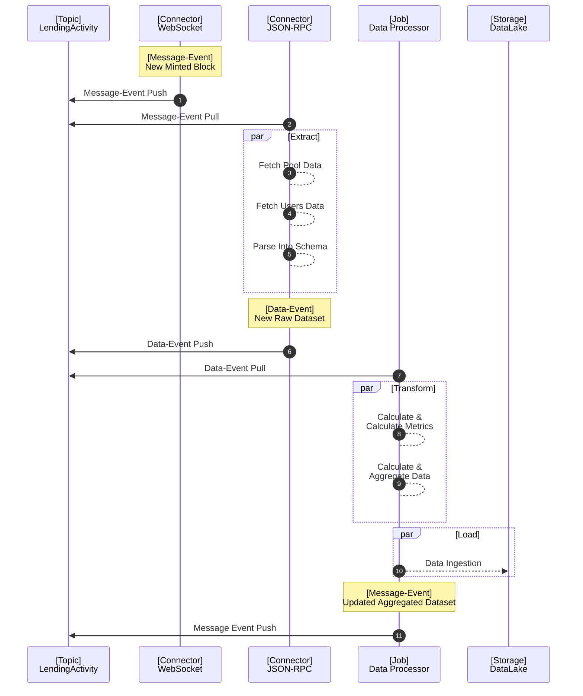

# Delorian

Assemble DeFi Data Artifacts Based on Delta in Time Approach.

## Project Structure

```
delorian/
│ 
├── scripts/
│   └── start-service.sh
│ 
├── src/
│   ├── config/
│   │   └── kafka.ts
│   ├── consumers/
│   │   └── messageConsumer.ts
│   ├── models/
│   │   └── message.ts
│   ├── producers/
│   │   └── messageProducer.ts
│   ├── utils/
│   │   └── logger.ts
│   ├── testPublisher.ts
│   │── testSubscriber.ts
│   └── index.ts
│ 
├── .gitignore
├── docker-compose.yml
├── package.json
├── tsconfig.json
└── README.md
```

## Architecture



## Usage

1. Start kafka server

```
./scripts/start-kafka.sh
```

2. build docker kafka (server), zookeeper (manager), delorian (connectors) with compose

```
docker-compose up --build
```

3. Run scripts as example

```
npx ts-node connector_websocket.ts
```

## Dependencies

The aave library has a peer dependency of ehters on its v5, and it wont work with v6

```shell
npm install ethers@5
```

Then the aave libraries can be installed

```shell
npm install @aave/contract-helpers @aave/math-utils
```

And, another useful utility would be the adress book as wallet address catalog.

```shell
npm install @bgd-labs/aave-address-book
```

Install PostgreSQL

```
npm install pg @types/pg
```

## Roadmap

- Include a data-pipeline with a Fetcher and a Exporter
- Include a data-lake with an SQL instance
- Include some rust-code for data transformations as a PoC MLOps ETL
- Include a data-warehouse with an SQL instance
- Include testing with [ts-jtest](https://kulshekhar.github.io/ts-jest/docs/)

